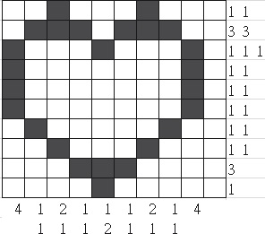
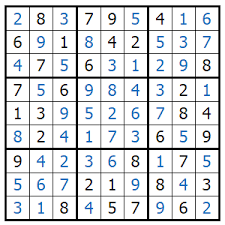
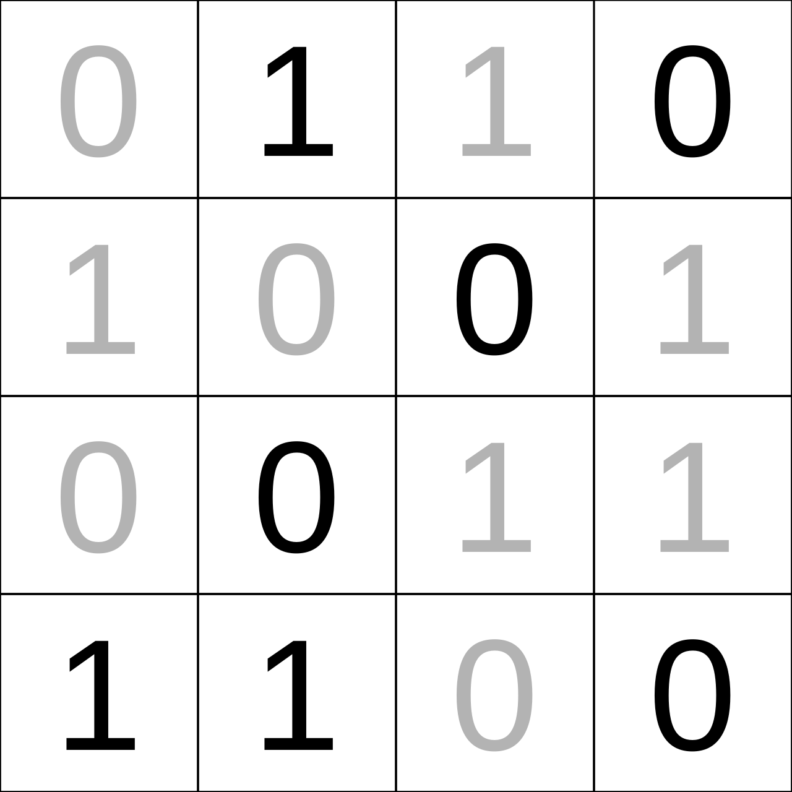

# Puzzle Generators

> Note: The repository is a WIP. I'm currently working on the design document where I want to explain everything before coding it.

Within this document is stated the general logic to **generate and solve** some board puzzles.

Here is defined a **board puzzle** as any logic puzzle that takes place at an NxM chess board.
This board does not require to have white and black cells, but it is divided into single cells.
Depending on the puzzle, other rules might apply over the board.

The following are the puzzles (alphabetically sorted) contained within the repository:

- [Nonogram](#nonogram)
- [Numberlink](#numberlink-connecting-pipes)
- [Queens](#queens)
- [Sudoku](#sudoku)
- [Takuzu](#takuzu)

## Puzzles Descriptions

### Nonogram

A **Nonogram** is a paint-by-number type of puzzle defined over an M*N board.
Each row and column have an ordered sequence of numbers, which define how many cells must be colored within that row or column.
The separation of the numbers means that the sets of colored cells must be separated by at least one uncolored cell.

These puzzles can be colored in black and white, describing a binary image, or they can use different colors.

_Example_ 
Considering a 10x10 board, a single column has the numbers "3 4 1".
Because the column has a maximum of 10 positions, and each set of colored cells must be separated, it is known that the solution for this row is "ccc.cccc.c" or "1110111101" where `c` or `1` correspond to the colored cell.

Let's consider now a different column within the same board with the numbers "2 5".
Without more information, this column might have multiple solutions as:

- The total number of colored cells plus an extra uncolored cell in between them does not match to 10.
- The column can start or end either with a colored or a non-colored cell.
- The set of colored cells must be separated by at least one uncolored cell. Thus, the separation by uncolored cells can be greater than 1.

> WIP: I am working on extra documentation about this puzzle and its algorithms.

### Numberlink (connecting pipes)

> WIP: I am working on extra documentation about this puzzle and its algorithms.

### Queens

The **Queens** puzzle is a variation to the [_Eight queens chess puzzle_](https://en.wikipedia.org/wiki/Eight_queens_puzzle)

> WIP: I am working on extra documentation about this puzzle and its algorithms.

### Sudoku

A **Sudoku** is a puzzle in which missing numbers are to be filled into a 9 by 9 grid of squares which are subdivided into 3 by 3 boxes so that every row, every column, and every box contains the numbers 1 through 9.

Even though the previous definition corresponds to a classical Sudoku, other versions exists where one or more of the following rules apply:

- The board is size M by N, where at least one M or N is different to 9.
- The board is subdivided into regions. The numbers stated within each region must add to a final number.
- Each major cell is part of 2 different Sudoku boards.
- Another different rule modify the previous definition of a Sudoku.

[Read about this puzzle algorithms](./docs/sudoku/readme.md).

### Takuzu

A **Takuzu** (also known as **Binairo**) is a logic puzzle that involves the placement of two symbols (e.g.: 1 and 0) over a grid board.
The general rules for any Takuzu are:

- Each row and column must contain the same number of each symbol.
- No more than two equal symbols can be connected horizontally or vertically.

> WIP: I am working on extra documentation about this puzzle and its algorithms.
