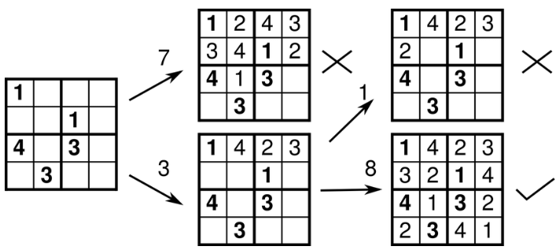

# Project Design Document

## Overview

Within this document is stated the general logic to **generate and solve** some board puzzles.

Here is defined a **board puzzle** as any logic puzzle that takes place at an NxM chess board.
This board does not require to have white and black cells, but it is divided into single cells.
Depending on the puzzle, other rules might apply over the board.

The following are the puzzles (alphabetically sorted) contained within the repository:

- Nonogram [WIP]
- Pipes [WIP]
- Queens [WIP]
- [Sudoku](#sudoku)
- Tango [WIP]

## Sudoku

A Sudoku is a puzzle in which missing numbers are to be filled into a 9 by 9 grid of squares which are subdivided into 3 by 3 boxes so that every row, every column, and every box contains the numbers 1 through 9.

Other version of Sudoku exists where one or more of the following rules apply:

- The board is size M by N, where at least one M or N is different to 9.
- The board is sub-divided into regions. The numbers stated within each region must add to a final number.
- Each major cell is part of 2 different Sudoku boards.
- Another different rule modifify the previous definition of a Sudoku

### Solver: Backtracking algorithm

The backtracking algorithm consists on making a (valid) number guess over an empty cell and sequentially continuing doing so until all cells have a number (puzzle solved) or a guess was incorrect.

This algorithm iterates over the next five steps:

1. **An empty space is found**. It does not matter if the algorithm iterates over columns and then over rows, vice versa or takes a random coordinate to find an empty space. The goal is to start with an emtpy space.
2. **A guess is made**. The guess is just any number which is not contained in the row, column or major tile. This guess is only a valid number to be positioned at the current tile, but it doesn't have to be the correct one.
3. **Continue iterating steps 1 and 2**. With this, the tree continues expanding, creating new branches every time a new guess is made in a tile where multiple valid numbers can be used as a guess.
4. **Go back** to the last created branch if the puzzle reach a tile in which no valid guesses can be done.
5. **Iterate** until a solution is found.

These steps can lead to two possible outcomes:

- **A solution is found**. It was possible to find a solution by the backtracking algorithm. This does not mean the found solution is the only solution.
- **No solution was found**. In this case, we are possitive all numbers were tried over all empty cells. The conclusion of this case is that the initial Sudoku board is not solvable.
